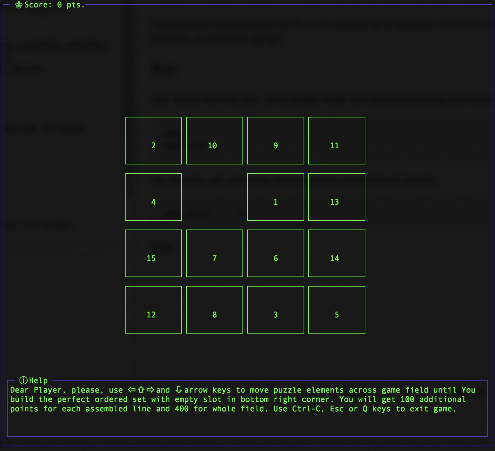

# 15 puzzle game [](https://travis-ci.com/mujichOk/15puzzle)

Experimental implementation of [15 puzzle](https://en.wikipedia.org/wiki/15_puzzle) game engine based on [TypeScript](https://www.typescriptlang.org/) with elements of functional design. 


## Run

Use regular terminal app. Go to project folder and execute following commands:

```
npm i
npm start
```

You can also get some help about available application cli params:

```
npm start -- -h
```

That is how application should looks like in terminal



Enjoy.
